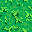
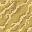
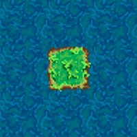
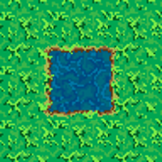
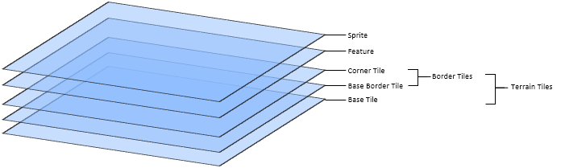
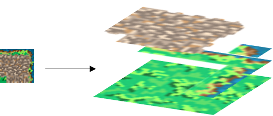

===================


A free-to-use, dynamic tileset.

<a rel="license" href="http://creativecommons.org/licenses/by/4.0/"></a><br />Designed by David Gwizdala, licensed under a <a rel="license" href="http://creativecommons.org/licenses/by/4.0/">Creative Commons Attribution 4.0 International License</a>.

----------
## Table of Contents ##

 - [Tiles](#tiles)
	 - [Base Terrain Types](#base-terrain-types)
	 - [Border Types](#border-types)
		 - [Border Overlay](#border-overlay)
			 - [Base Naming Convention](#base-naming-convention)
			 - [Corner Naming Convention](#corner-naming-convention)
		 - [Terrain Hierarchy](#terrain-hierarchy)
- [Sample Algorithm for Terrain Placement](#sample-algorithm-for-terrain-placement)
- [Layering Schema](#layering-schema)

Tiles
-------------
Tiles consist of 32x32 pixel, **non-rotatable** squares. Tiles have a **base terrain type**, used as the base layer in procedurally generating the map, and **border types**, overlayed over the base terrain type to allow for smoother transition between different terrain.

### Base Terrain Types

The current terrain types are:

- **Water** 
- **Grass** 
- **Sand** 
- **Snow** 

To access the base terrain tile of any terrain type, navigate to the directory with **that item's name** and reference `spr_[terrain_type]_center.png`, where `[terrain_type]` is the type of terrain. On every tile, the **base terrain type** will be referenced in the name, with the subdirectory detailing border (detailed below).

For example, the base terrain type of water is located at the path `./Water/spr_water_center.png`.

### Border Types

All borders between tiles are unique, and follow a strict set of rules on how to overlay them.

#### Border Overlay
All border types consist of 12 32x32 pixel overlay tiles. Their names consist of a **base naming convention**, used to define their exact location on the border, and of a **corner naming convention**, used specifically on tiles bordering on a corner (more details below). 

##### Base Naming Convention
The **base naming convention** is as follows:


For example, any tile bordering the left side of grass will be referenced in their appropriate subdirectory as `spr_grass_left.png`.

##### Corner Naming Convention
The **corner naming convention** applies only to corners, as there are two possible cases for tile cornering. 

**Note: When building borders, always place the non-corner borders (top, bottom, left, right) first as they may be overlayed with a corner tile.**

Firstly, there is the case of the base tile extending into the border tile, such as an island in the water. Think of this as an extruded corner. This is considered an **outer corner**, designated with the `outer` tag. **The outer corner requires the use of side borders**. *Note: The tile overlay is still on the base tile, which means that the corner does not literally extend into the border tile - it simply creates the guise of doing so.*



For example, any tile creating an outer corner on the top left side of grass will be referenced in their appropriate subdirectory as `spr_grass_outer_tl.png`.

Secondly, there is the case of the border tile extending into the base tile, such as a lake or a pond. Think of this as a recessed corner. This is considered an **inner corner**, designated with the `inner` tag. **The inner corner does not require the use of side borders.**



For example, any tile creating an inner corner on the top left side of grass will be referenced in their appropriate subdirectory as `spr_grass_inner_tl.png`.

A diagram detailing corner naming is shown below.


To summarize, when placing border types place the non-corner tiles first, and then determine whether the corner tiles protrude or recede from the bordering tile.

#### Terrain Hierarchy
Terrain borders follow a **Terrain Hierarchy**, defined as shown:

**Snow** &#11175;

&nbsp;&nbsp;&nbsp;&nbsp;&nbsp;&nbsp;**Sand** &#11175;

&nbsp;&nbsp;&nbsp;&nbsp;&nbsp;&nbsp;&nbsp;&nbsp;&nbsp;&nbsp;&nbsp;&nbsp;**Grass** &#11175;

&nbsp;&nbsp;&nbsp;&nbsp;&nbsp;&nbsp;&nbsp;&nbsp;&nbsp;&nbsp;&nbsp;&nbsp;&nbsp;&nbsp;&nbsp;&nbsp;&nbsp;&nbsp;**Water**

In the hierarchy, tiles provide border types **only for the tiles below it**, with no knowledge of the tiles above. This aims to follow standard blending of real-life terrain. It is recommended to consider the lowest tile the base case, as it does not follow any rules for bordering.

For example, the tile highest on the hierarchy, **Snow**, provides border tiles for all types, while **Sand** provides border tiles for **Grass** and **Water**, **Grass** provides border tiles for **Water**, and **Water** does not provide border tiles at all.

To access the border tiles of any terrain type, navigate to the directory with **the base item's name** and the subdirectory with the **border item's name** and reference `spr_[terrain_type]_[border].png`, where `[terrain_type]` is the base terrain type and `[border]` is the side/corner that you are bordering.

For example, to overlay a border tile of water on the left side of grass you would navigate to the path `./grass/water/spr_grass_left.png`.

Sample Algorithm for Terrain Placement
-------------

Here is a sample description of an algorithm for terrain placement in a grid:
```
for each piece of terrain T:
    let BORDERS = the terrain adjacent to  T
    for each BORDER in BORDERS:
    	if  T is below BORDER in the hierarchy then 
	    layer the corresponding border tile on top of T
			
    let CORNERS = the terrain diagonal to T
    for each CORNER in CORNERS:
	if T is below CORNER in the hierarchy then
	    let adj1 and adj2 = the two pieces of terrain bordering both  T and CORNER (so if CORNER
	    is the top right diagonal, then adj1 and adj2 are the terrain above and to the right of T)
			
	    if adj1 and adj2 are both below CORNER in the hierarchy:
	        then CORNER is "flooding over" adj1 and adj2, and thus should be flooding over the
		corner of  T, so place an "outer" corner tile on top of T
	    else if adj1 and adj2 are both above T in the hierarchy: 
		then T is being "flooded over" by adj1 and adj2 so:
		
		if adj1 and adj2 are the same type of terrain:
		    place an "inner" corner tile of that type on T
		else 
		    figure out if adj1 or adj2 is lower in the hierarchy, and make sure the border 
		    for that terrain is placed on top of the other one on T
```

Layering Schema
-------------

To draw the entire scene on a grid square, follow the below diagram for best visual results.



To better illustrate this schema, an example is shown below where a grass square corners water and contains a road.


